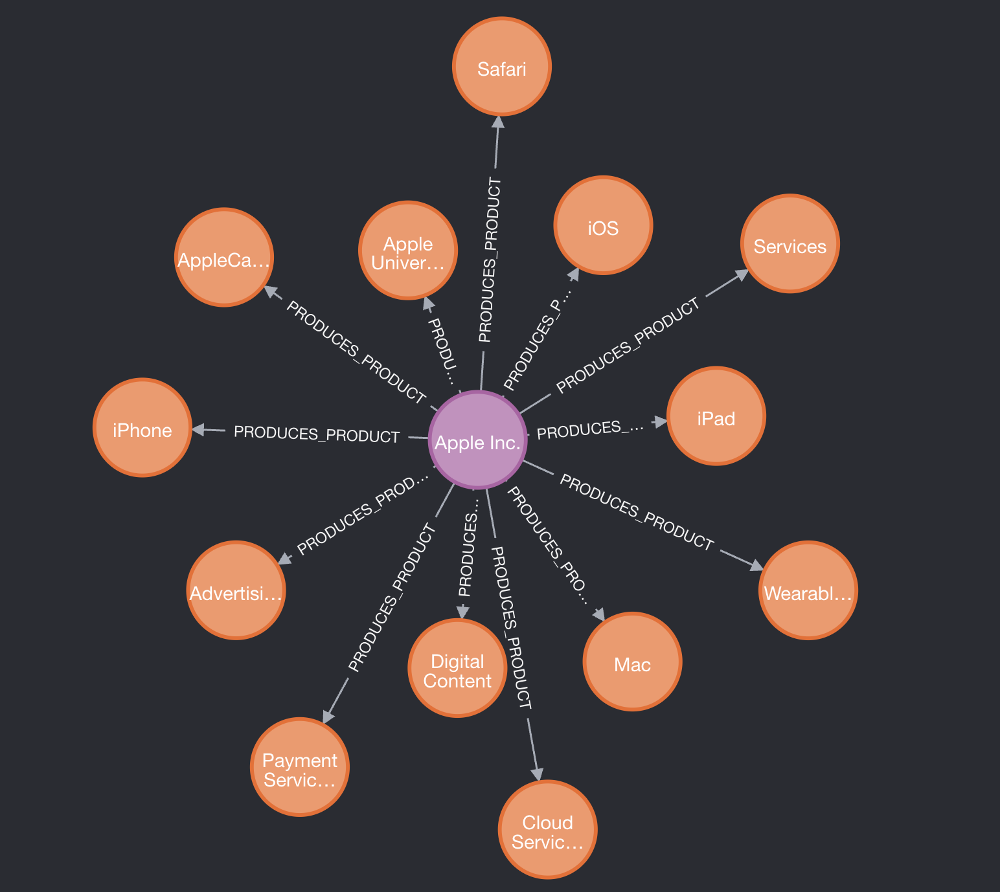
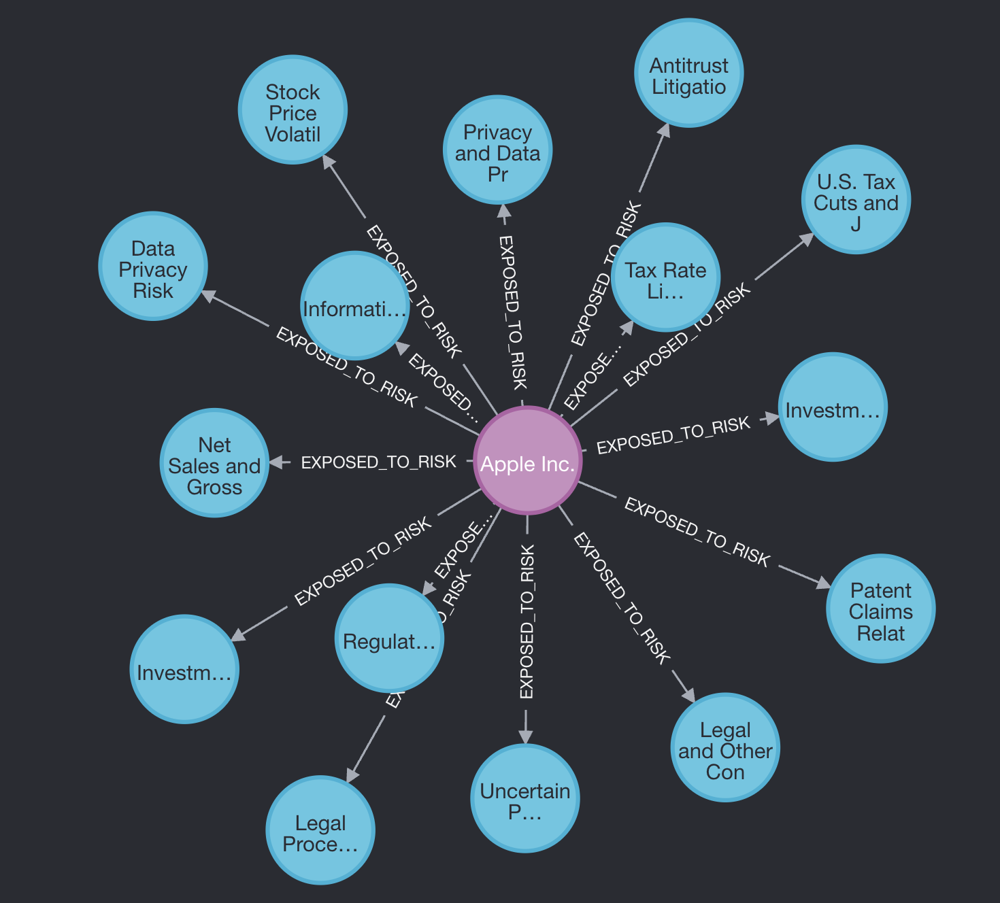
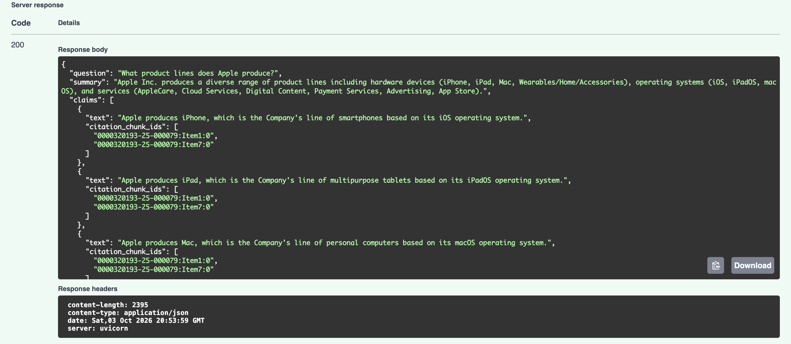

# SEC GraphRAG

Hybrid **knowledge-graph + vector RAG** over SEC **10-K** filings: extract a closed financial ontology into Neo4j, embed the same chunks into pgvector, route each question to graph and/or vectors, and answer only with **validated chunk citations**.

Built as an end-to-end systems project (not a ChatGPT wrapper): closed-world schema, **no model-written Cypher**, citation allowlists, cost-gated corpus growth, and a hop-stratified hybrid vs vector-only benchmark.

---

## Why this exists

| Problem | Approach here |
|---------|----------------|
| Embeddings alone blur *relationships* (who competes with whom, what risks attach to which issuer) | Graph path over a fixed ontology + parameterized Cypher templates |
| LLMs invent citations | Every claim’s `chunk_id` must appear in *this* retrieval’s allowlist (else reject / regenerate) |
| Multi-company graphs silently merge the wrong nodes | Ticker-scoped risks/products/execs; shared companies keep `home_ticker` + `tickers[]` |
| Cross-filing extract invents edges on global companies (e.g. Meta→`APPLE` products) | Issuer-owned write gate + retrieve-time chunk ticker filter on graph evidence |
| “RAG demos” skip measurement | Hop-stratified **hybrid vs vector-only** suite with LLM-as-judge (keyword secondary) |

---

## Architecture

```text
10-K Items 1 / 1A / 7
  → chunk + content-hash cache
  → Claude + Instructor → closed ontology JSON
  → entity resolution → Neo4j MERGE (edges carry source_chunk_ids)
  → same chunks → OpenAI embeddings → pgvector (shared chunk_id)

Question → Haiku router (graph | vector | both)
  → graph: allowlisted Cypher templates only (multi-template for hop-2)
  → vector: HNSW top-k
  → grounded answer + citation validation → FastAPI POST /ask
```

**Ontology (6 / 8):** Company, Subsidiary, Supplier, ProductLine, RiskFactor, Executive · OWNS_SUBSIDIARY, SUPPLIED_BY, COMPETES_WITH, EXPOSED_TO_RISK, PRODUCES_PRODUCT, DEPENDS_ON, LED_BY, OPERATES_IN_SEGMENT

<p align="center">
  
  
</p>
<p align="center">
  
</p>


---

## Benchmark (hybrid vs vector-only)

Suite: `multi_company_smoke` v2 — **24** hand-labeled questions on a local **10-ticker** corpus  
(`AAPL AMZN GOOGL JNJ JPM META MSFT NFLX NVDA XOM`, full Item 1/1A/7).

**Primary metric:** LLM-as-judge (Haiku + Instructor) correctness vs hand-authored `required_facts` / `gold_answer`.  
OOS items score as correct refuse. Keyword recall is kept as a **secondary** field in the JSON report.  
Not a 50–100 Q human panel — still an automated grade, but much closer to answer quality than substring hits.  
**Judge calibration:** human agreed with judge on **24/24** hybrid answers (`benchmarks/judge_calibration_hybrid.md`).

| Hop / bucket | Hybrid | Vector-only | n |
|--------------|-------:|------------:|--:|
| Hop 0 (definitions) | 0.92 | **1.00** | 6 |
| Hop 1 (single edge) | **1.00** | 0.81 | 8 |
| Hop 2 (compare / multi-rel) | **0.90** | 0.83 | 6 |
| OOS (must refuse) | **1.00** | **1.00** | 4 |
| **Overall mean** | **0.95** | 0.90 | 24 |

Report: [`benchmarks/results/multi_company_smoke_judged.json`](benchmarks/results/multi_company_smoke_judged.json)  
(hop-1 rebench after cross-company filter exempt + produce yes/no pack fix; hop-0/2/OOS from prior full rebench)

**How to read it:** Under fact-checklist judging, **hybrid leads hop 1–2 and overall** (1.00 / 0.90 / 0.95). Vector-only still leads hop 0 (definitions). Keyword-only scores previously overstated hop 1–2; the judge still catches partial / contradictory answers those needles missed.

**Systems fixes from eval:** (1) Graph retrieve once cited Meta accession chunks on Apple **products** — issuer-owned write gate + chunk ticker filter + Neo4j cleanup. (2) That same filter then dropped Meta-stamped `COMPETES_WITH` for Apple asks — exempt cross-company rels at retrieve. (3) J&J “MedTech?” graph-only laundry list → force `both` + drop unmatched `PRODUCES_PRODUCT` on yes/no product asks.

---

## Example answers (from the hybrid rebench)

**Q:** What product lines does Apple produce? · route `graph` · `citations_valid`

> Apple produces hardware (iPhone, iPad, Mac, Wearables…), OSes, and services (AppleCare, Cloud Services, …).

Cites include `0000320193-25-000079:Item1:0`, `…:Item7:0`.

**Q:** What compute products does NVIDIA produce, and what geopolitical risks is it exposed to? · route `both`

> NVIDIA produces data-center / gaming GPUs (A100, H100, …) and faces geopolitical / export-control risk (e.g. China-related controls) among other exposures.

Cites include `0001045810-26-000021:Item1:0`, `…:Item1A:3`, …

---

## Quick start

```bash
docker compose up -d
python -m venv .venv && source .venv/bin/activate   # Windows: .venv\Scripts\activate
pip install -r requirements.txt
cp .env.example .env   # add ANTHROPIC_API_KEY + OPENAI_API_KEY
```

**Ask (needs a built local corpus — your Docker volumes + `data/` caches):**

```bash
python answer.py "What product lines does Apple produce?" --ticker AAPL
python answer.py "What is AppleCare?" --ticker AAPL

python -m uvicorn api:app --host 127.0.0.1 --port 8000
# POST http://127.0.0.1:8000/ask
# {"question":"What product lines does Apple produce?","ticker":"AAPL"}
```

**Grow corpus (paid — always budget first):**

```bash
python grow_corpus.py MSFT JPM --budget
python grow_corpus.py MSFT JPM --confirm --max-chunks 5   # cheap smoke
```

**Benchmark (paid answer run; judge is cheaper Haiku):**

```bash
python benchmark_runner.py --suite benchmarks/multi_company_smoke.json --limit 2
python benchmark_runner.py --suite benchmarks/multi_company_smoke.json --confirm
# Re-score saved answers with LLM judge (no answer re-run):
python benchmark_runner.py --suite benchmarks/multi_company_smoke.json \
  --rejudge benchmarks/results/multi_company_smoke_full_rebench.json --confirm
```

Neo4j Browser: http://localhost:7474 (`neo4j` / `password` by default) · API docs: http://127.0.0.1:8000/docs

---

## Repo map

| Area | Files |
|------|--------|
| Ingest / extract / resolve / write | `ingest.py`, `extractor.py`, `resolver.py`, `graph_writer.py` |
| Vectors | `embedder.py`, `vector_db.py` |
| Retrieve / answer / API | `router.py`, `graph_retriever.py`, `vector_retriever.py`, `answer.py`, `api.py` |
| Batch growth / budget | `grow_corpus.py`, `budget.py` |
| Eval | `benchmarks/`, `benchmark_runner.py`, `benchmark_judge.py`, `chunk_ticker.py` |
| Learning / interview log | [`docs/PROBLEMS_AND_FIXES.md`](docs/PROBLEMS_AND_FIXES.md) — bugs we hit and how we fixed them |
| Dev notes | `HANDOFF.md` |

---

## Status

End-to-end **demo-quality** system: Phases 1–5 of the original build curriculum, plus a live 10-company local corpus and multi-company correctness fixes. **Not** a production multi-tenant service.
